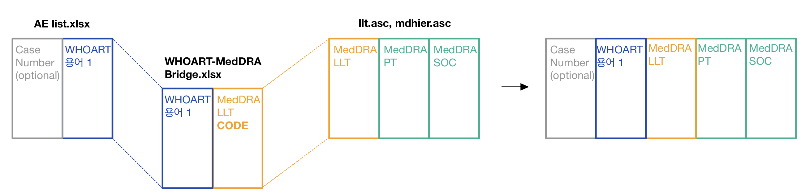
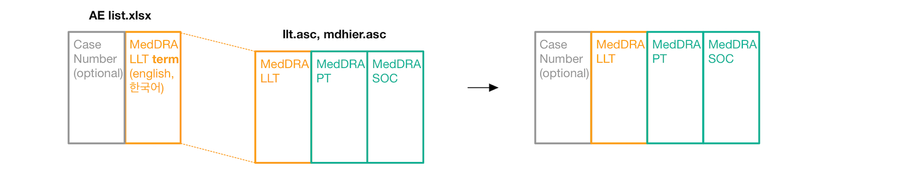
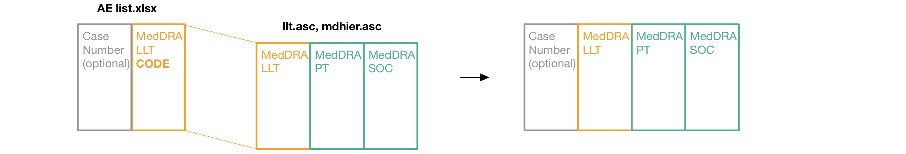

**GENERATE MEDDRA TERMS**

Program modes:

1. **AE list WHOART indexing**

 - Required files: 
    * `AE list.xlsx`
    * `WHOART-MedDRA Bridge.xlsx`
    * MedDRA_English 폴더 $\rightarrow$ MedAscii 폴더 $\rightarrow$ `llt.asc`,  `mdhier.asc`
 - Effect: `AE list.xlsx`에 있는 WHOART 용어1을 `WHOART-MedDRA Bridge.xlsx`에 매칭한 후, `llt.asc`/`mdhier.asc` 에 있는 MedDRA SOC 및 PT 컬럼을 붙여 놓기.

2. **Bridge Extension**

 - Required files:
    * `WHOART-MedDRA Bridge.xlsx`
    * MedDRA_English 폴더 $\rightarrow$ MedAscii 폴더 $\rightarrow$ `llt.asc`,  `mdhier.asc`
 - Effect: `WHOART-MedDRA Bridge.xlsx`에 있는 MedDRA LLT을 `llt.asc`/`mdhier.asc` 에 있는 MedDRA SOC 및 PT 컬럼을 붙여 놓기.

3. **AE list Extension**

 - Required files: 
    * `AE list.xlsx`
    * MedDRA_English 폴더 $\rightarrow$ MedAscii 폴더 $\rightarrow$ `llt.asc`,  `mdhier.asc`
 - Effect: `AE list.xlsx`에 있는 MedDRA LLT을 `llt.asc`/`mdhier.asc` 에 있는 MedDRA SOC 및 PT 컬럼을 붙여 놓기.

**INSTRUCTIONS**
1. Binder site 방문 (https://mybinder.org/):
 - GitHub 선택 확인 후 입력: `https://github.com/medisafepv/MeddraExtension`
 - Git ref 입력: `main`

2. Launch (1-5분)

3. 왼쪽 파일 탐색기 패널에서 `final_WM.ipynb` 더블클릭
